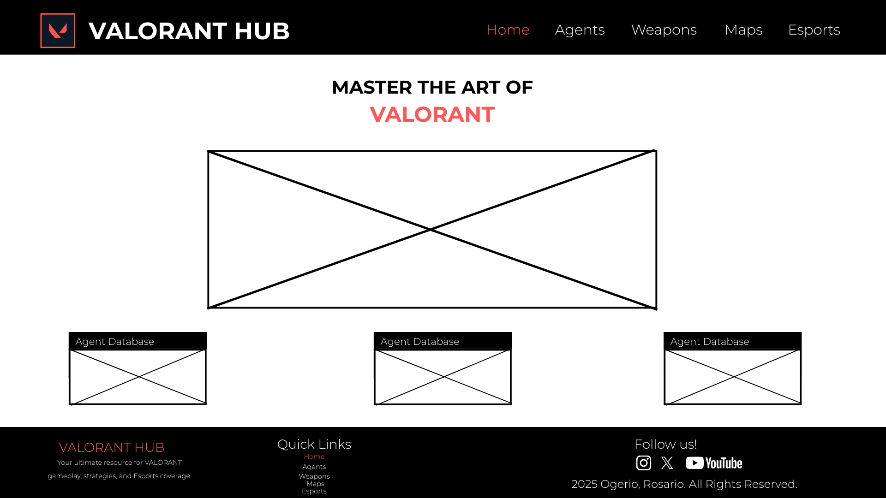
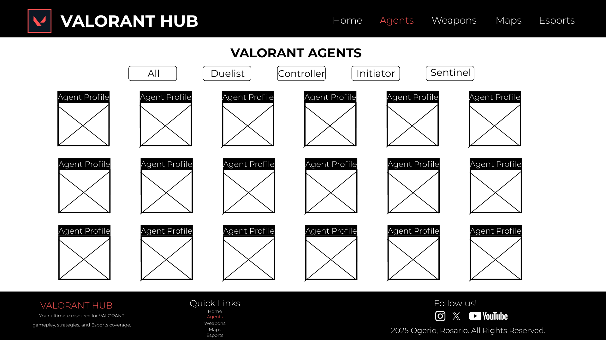
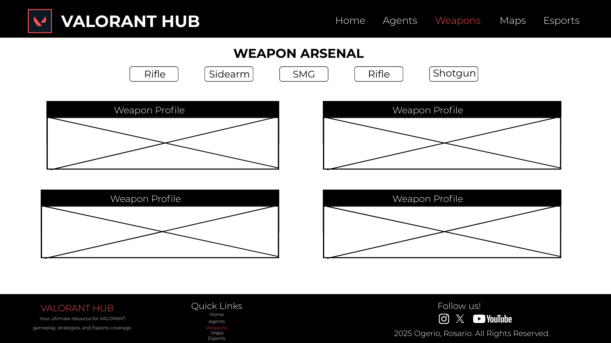
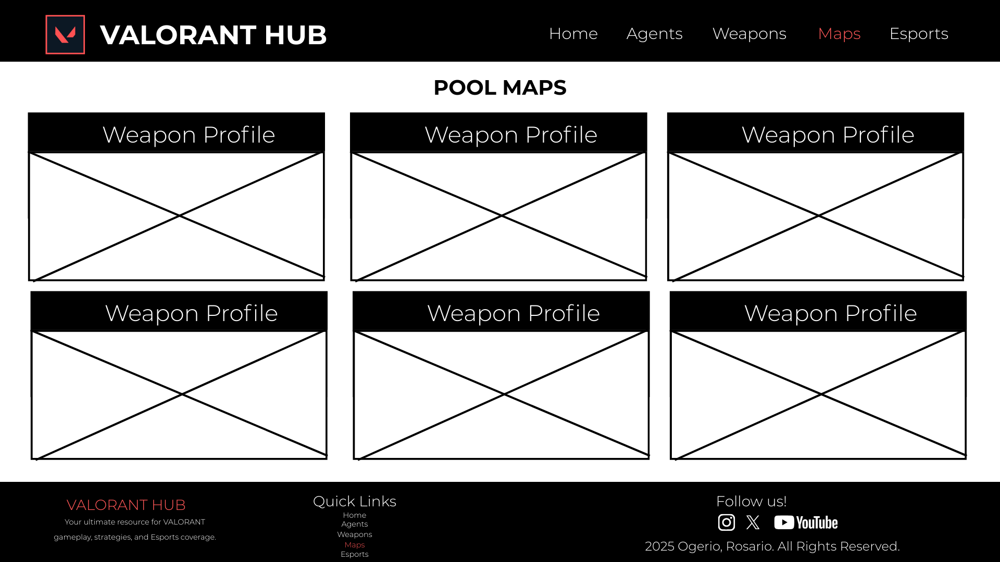
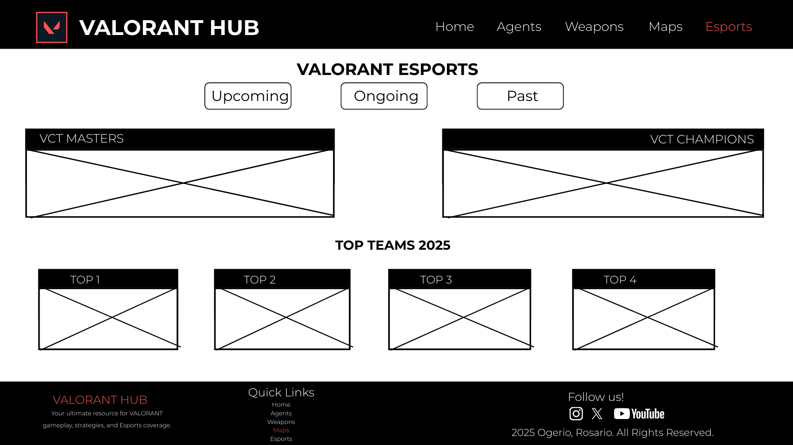

# VALORANT HUB  
**Project Team Name:** WDProjRbOgerioRosario 
**Quarter:** 3rd Quarter Project Proposal  

---

## Website Title
**Valorant Hub**

## Secondary Website Title
**Master the Art of Valorant**

---

## Logo

## Website Description
Valorant Hub is a fan-made informational website focused on the tactical shooter game **VALORANT** developed by Riot Games. The website is designed to present important game-related information in a clear, organized, and visually structured way.

The goal of the website is to help both new and experienced players better understand the game by providing easy access to information about agents, weapons, maps, and esports. The website combines structured layouts with interactive features to create an engaging and educational browsing experience.

---

## Website Pages Outline

### Home
The Home page serves as the main landing page of the website. It introduces the purpose of Valorant Hub and gives users a general overview of what the website offers. This page includes a hero banner, short descriptions of major sections, and navigation links that guide users to other parts of the website.

### Agents
The Agents page displays a collection of Valorant agents arranged in a grid layout. Agents are grouped based on their roles, such as Duelist, Controller, Initiator, and Sentinel. This page helps users understand the different roles in Valorant and how each agent contributes to team gameplay.

### Weapons
The Weapons page presents the Valorant weapon arsenal categorized into sidearms, SMGs, rifles, and shotguns. Each weapon category is displayed in a structured format that allows users to browse and compare weapon types easily.

### Maps
The Maps page features a table that lists the different Valorant maps. The table includes the map name, type, and a visual preview. This page helps users become familiar with the environments where matches take place.

### Esports
The Esports page provides information about the competitive side of Valorant. It highlights major tournaments, professional teams, and explains the role of esports in the Valorant community.

### User Access
The User Access page contains an HTML form that allows users to input basic information and preferences. This page demonstrates how user input can be collected using forms and handled using JavaScript.

---

## JavaScript Integration Explanation
JavaScript is used across the website to enhance interactivity and improve user experience. It is responsible for features such as interactive navigation, dynamic content display, and table organization.

JavaScript is also used to handle form submissions by saving user input using the browser’s local storage. This allows the website to store user data without requiring an online database and demonstrates basic client-side data handling.

---

## HTML Form Design and Narrative

### Purpose of the HTML Form
The HTML form is designed to collect basic user information such as a username, preferred agent role, and favorite weapon category. The purpose of the form is to demonstrate how websites gather user input in a structured and controlled way.

### Data Storage Method
All data collected from the form is saved using JavaScript’s `localStorage` feature. This allows the information to be stored locally on the user’s computer through the browser.

### Usage of Collected Data
The collected data is used on other pages of the website to demonstrate how saved information can be retrieved and reused. This shows how websites can maintain data even after the page is refreshed.

---

## Webpages Using the HTML Form Data

### User Form Page
This page contains the HTML form where users enter their information and preferences, AKA the signup and login page. Once the form is submitted, JavaScript processes the input and saves the data to local storage.

### User Information Page
The User Information page displays the information previously submitted by the user. It shows stored data such as the username and preferences, confirming that the data was saved successfully. Aside from this, it contains personalized data like their favourite map or gun.

### Community/Feedback Polls Page
The Community Polls page allows users to participate in simple polls related to Valorant, such as favorite agent role or preferred weapon type. Poll responses are stored using local storage and displayed in a summarized format, demonstrating how collected data can be reused in an interactive and engaging way. Aside from this, this page also serves as feedback or a survey on a scale of how the website is actually helpful.

---

## Wireframe and Mock-Up Description
Each webpage follows a consistent layout consisting of a header, main content area, and footer. The header includes the website logo and navigation bar, while the main content area displays text, images, tables, or forms depending on the page.

The wireframes clearly show the placement of page titles, section headers, navigation elements, and content sections to ensure the layout is easy to understand and navigate.

---

## Navigation Design
The navigation bar is present on all pages of the website and allows users to easily move between the Home, Agents, Weapons, Maps, Esports, and User Access pages. This consistent navigation design ensures a smooth browsing experience.

---

## Footer Design
Each webpage includes a footer located at the bottom of the page. The footer contains copyright information, source citations, and social media links. Social media links are displayed using well-known image sprites such as Facebook, Twitter (X), YouTube, and Instagram.

---

# 3rd Q Update

## Final Title
Valorant Hub

## Two-Sentence Description
Valorant Hub is an informational website created to help players learn more about Valorant’s agents, weapons, maps, and esports scene. The website combines structured content and interactive elements to support an engaging and educational experience.

## Features
- The website includes interactive visual elements that make the pages more engaging and dynamic. When users hover over weapon or agent cards, the cards flip to reveal additional information, and the hovered card is highlighted in red to clearly indicate user interaction.
- The homepage features tips presented with images and subtle shadow effects. These design elements create a three-dimensional appearance that adds depth and improves the overall visual appeal of the website.
- The website contains organized and clearly structured pages dedicated to agents, weapons, maps, and esports content, allowing users to navigate and access information easily.
- JavaScript is used to implement interactive features such as hover effects, dynamic tables, navigation behavior, and community polls.
- An HTML form is integrated into the website to collect user information and preferences, which are stored using browser-based storage to demonstrate basic data persistence.

## Details
- The Valorant Hub website is developed using HTML, CSS, and JavaScript to create an interactive and visually engaging experience. HTML is used to structure the content of the website, including text, images, cards, tables, and forms. CSS is applied to design the layout, color scheme, hover animations, card flip effects, and shadow elements that give the website a three-dimensional appearance.

- JavaScript is used to control interactive features throughout the website. These features include hover-based card interactions for agents and weapons, table behaviors, navigation effects, and community polls. JavaScript is also responsible for processing form submissions and managing user input.

- User data collected through the HTML form is stored using the browser’s local storage feature. This allows the website to save user preferences directly on the user’s computer and retrieve them when needed. Overall, the website demonstrates how design and functionality can work together to create an informative, interactive, and user-friendly web experience.

## Definition of Done
The project will be considered complete when all webpages are functional, navigation works across all pages, JavaScript features operate correctly, user data is successfully stored and retrieved, and the final website aligns with the visual representation that we want or approve. 

