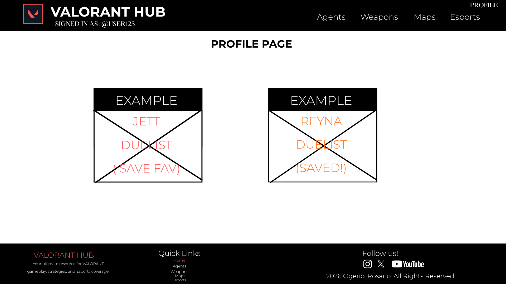
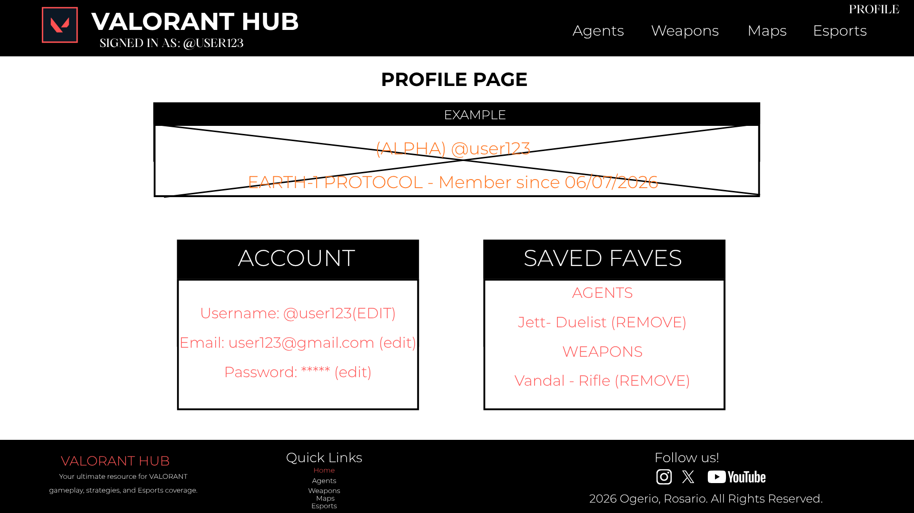
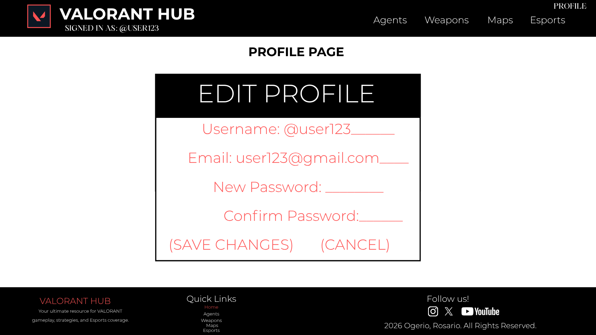
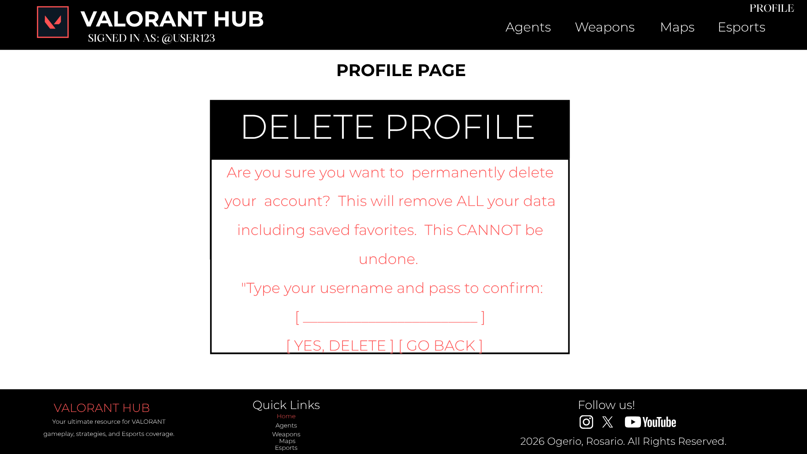

# VALORANT: THE OMEGA BREACH
### A VALORANT Informational Website

> Earth-1 and Earth-2 stand at the edge of annihilation. Choose your allegiance. The breach begins now.

A fan-made, non-affiliated informational website about VALORANT featuring Agents, Arsenal, Maps, Live Esports Hub, and more — built as a Web Development project.

---

## TABLE OF CONTENTS

- [Project Description](#project-description)
- [Pages Overview](#pages-overview)
- [Technologies Used](#technologies-used)
- [Team](#team)
- [FINAL MODIFICATION PROPOSAL](#final-modification-proposal)

---

## Project Description

VALORANT: The Omega Breach is a game informational website that covers everything a player needs to know about VALORANT. It uses a narrative framing of two opposing factions — **Alpha (Earth-1)** and **Omega (Earth-2)** — as its visual theme.

---

## Pages Overview

| Page | Description |
|------|-------------|
| **Home** | Summary of all site content and latest highlights |
| **Agents** | Detailed info on all VALORANT agents |
| **Arsenal** | Weapon stats and descriptions |
| **Maps** | Map layouts and callout info |
| **LiveHub** | Live esports news and match updates |
| **Architects** | About the team behind the site |
| **Sign Up** | Register a new account |
| **Sign In** | Log into an existing account |

---

## Team

- **Nathan Ogerio**
- **Ysa Rosario**

---

---

# FINAL MODIFICATION PROPOSAL

## Overview

This section outlines the final modification to the **VALORANT: The Omega Breach** website. The update introduces a complete **Full CRUD (Create, Read, Update, Delete)** process on data stored in `localStorage`, building on the Sign Up and Sign In features already in the project.

---

## Description: Purpose and How CRUD Is Implemented

### What Data Is Being Managed?

When a user registers via the **Sign Up** page, their account information is saved to `localStorage`. This currently includes:

- `username`
- `email`
- `password`
- `dateCreated`

Additionally, users who are signed in can **bookmark/favorite** items across the Agents, Arsenal, and Maps pages. These preferences are stored in `localStorage` under a key tied to their account: `favorites_<username>`.

---

### The Full CRUD Breakdown

| Operation | Page | What It Does |
|-----------|------|-------------|
| **CREATE** | Sign Up *(existing)* | Registers a new user; saves their account object to `localStorage` |
| **CREATE** | Agents / Arsenal / Maps *(updated)* | Adds a ★ Save Favorite button on each card; saves item to favorites list in `localStorage` |
| **READ** | User Profile Page *(new)* | Retrieves and displays the user's saved account details and favorites list from `localStorage` |
| **UPDATE** | User Profile Page — Edit Modal *(new)* | Allows the user to change their username, email, or password; saves the updated object back to `localStorage` |
| **DELETE** | User Profile Page *(new)* | Two forms: (1) Remove a single saved favorite item from the list; (2) Permanently delete the entire account and all associated data from `localStorage` |

---

### How It Is Used — User Journey

1. A visitor browses the site — reading about agents, weapons, maps, and esports news.
2. They **sign up** — their account is saved to `localStorage`. *(CREATE — existing)*
3. On return visits, they **sign in** and their info is loaded. *(READ — existing)*
4. While browsing **Agents, Arsenal, or Maps**, a signed-in user sees a ★ Save Favorite button on each card. Clicking it saves that item to their favorites list in `localStorage`. *(CREATE — new)*
5. On the new **User Profile page**, users can:
   - View their account info and full favorites list. *(READ)*
   - Click **Edit** next to any field to open a modal and change their username, email, or password. On save, the updated data overwrites the old record in `localStorage`. *(UPDATE)*
   - Click **✕ Remove** next to any saved favorite to delete just that item from their list. *(DELETE — partial)*
   - Click **Delete Account** to trigger a confirmation modal, then wipe all their data from `localStorage` and be redirected to the Home page. *(DELETE — full)*

---

### localStorage Keys Used

| Key | Contents | Operations |
|-----|----------|------------|
| `users` | Array of all registered user objects | CREATE, READ, UPDATE, DELETE |
| `currentUser` | Username string of the logged-in user | READ, DELETE |
| `favorites_<username>` | Object with `agents[]`, `weapons[]`, `maps[]` | CREATE, READ, DELETE |

---

### Pages Affected

| Page | Status | Changes |
|------|--------|---------|
| Sign Up | Existing | No change |
| Sign In | Existing | No change |
| Agents | Updated | Add ★ Save Favorite button to each agent card |
| Arsenal | Updated | Add ★ Save Favorite button to each weapon card |
| Maps | Updated | Add ★ Save Favorite button to each map card |
| **User Profile** | **New** | CRUD hub — view info, edit profile, remove favorites, delete account |

---

## Wireframes

### Wireframe 1 — Agents / Arsenal / Maps Pages (Updated)
**CRUD: CREATE — Save a Favorite**
 
Each agent, weapon, and map card now includes a ★ Save Favorite button visible to signed-in users. Clicking the button saves that item to the user's favorites list in `localStorage` under the key `favorites_<username>`. The button changes appearance to indicate the item has already been saved. This same behavior applies identically across the Agents, Arsenal, and Maps pages.

---

### Wireframe 2 — User Profile Page (New Page)
**CRUD: READ, UPDATE, DELETE**

The new User Profile page is the central hub for managing user data. It is split into two panels. The left panel displays the user's account details — username, email, and password — each with an Edit button beside it. The right panel shows the user's saved favorites grouped by category (Agents, Weapons, Maps), each with a Remove button. At the bottom of the page is a Delete Account button. All data displayed is retrieved directly from `localStorage`.

---

### Wireframe 3 — Edit Profile Modal
**CRUD: UPDATE**

Clicking the Edit button beside any account field opens a modal overlay on top of the Profile page. The modal contains input fields for username, email, new password, and confirm password, pre-filled with the current values. On clicking Save Changes, the inputs are validated (no empty required fields, passwords must match), the user object in `localStorage` is overwritten with the new values, a success message is shown, and the modal closes with the profile page refreshing to reflect the changes.

---

### Wireframe 4 — Delete Account Confirmation Modal
**CRUD: DELETE (Full Account)**

Clicking Delete Account on the Profile page opens a confirmation modal. The modal warns the user that all their data including saved favorites will be permanently removed and cannot be undone. The user must type their username into a field to confirm the action. On clicking Yes, Delete, the user's object is removed from the `users` array in `localStorage`, the `favorites_<username>` key is deleted, the `currentUser` session is cleared, and the user is redirected to the Home page.

---

*© 2026 @NathanOgerioYsaRosario. VALORANT: The Omega Breach — Web Development Project. Not affiliated with Riot Games.*